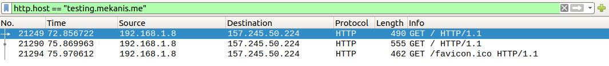

# Jarkom_Modul1_Lapres_D03

 - Display Filter :
	 * <a href="#soal-1">soal 1 </a>
	 * <a href="#soal-2">soal 2 </a>
	 * <a href="#soal-3">soal 3 </a>
     * <a href="#soal-4">soal 4 </a>
     * <a href="#soal-5">soal 5 </a>
     * <a href="#soal-6">soal 6 </a>
     * <a href="#soal-7">soal 7 </a>
     * <a href="#soal-8">soal 8 </a>
     * <a href="#soal-9">soal 9 </a>
     * <a href="#soal-10">soal 10 </a>
 - Capture Filter :
	 * <a href="#soal-11">soal 11 </a>
	 * <a href="#soal-12">soal 12 </a>
	 * <a href="#soal-13">soal 13 </a>
     * <a href="#soal-14">soal 14 </a>
     * <a href="#soal-15">soal 15 </a>

## Display Filter
<justify>

1. Sebutkan webserver yang digunakan pada "testing.mekanis.me"! 

<code> http.host == "testing.mekanis.me" </code>

<code> Klik kanan -> Follow -> Http Stream </code>

</justify>

<justify>

2. Simpan gambar "Tim_Kunjungan_Kerja_BAKN_DPR_RI_ke_Sukabumi141436.jpg"!

<code> file → export object → http → cari jpg → nemu download gambarnya </code>

</justify>

<justify>

3. Cari username dan password ketika login di "ppid.dpr.go.id"!

<code> http.host == "ppid.dpr.go.id" and http.request.method==POST </code>

</justify>

<justify>

4. Temukan paket dari web-web yang menggunakan basic authentication method!

<code> http.authbasic </code>

</justify>

<justify>

5. Ikuti perintah di aku.pengen.pw! Username dan password bisa didapatkan dari file .pcapng!

<code> http.host == "aku.pengen.pw" </code>

<b>Urutan T568B</b>  
Urutan ke 1 : Putih Orange RD+ (data terima+)  
Urutan ke 2 : Orange RD- (data terima-)  
Urutan ke 3 : Putih Hijau TD+ (data kirim +)  
Urutan ke 4 : Biru NC (tidak dipakai)  
Urutan ke 5 : Putih Biru NC (tidak dipakai)  
Urutan ke 6 : Hijau TD- (data kirim -)  
Urutan ke 7 : Putih Coklat NC (tidak dipakai)  
Urutan ke 8 : Coklat NC (tidak dipakai)  

</justify>

<justify>

6. Seseorang menyimpan file zip melalui FTP dengan nama "Answer.zip". Simpan dan Buka file "Open This.pdf" di Answer.zip. Untuk mendapatkan password zipnya, temukan dalam file zipkey.txt (passwordnya adalah isi dari file txt tersebut).

<code> ftp-data : buat cari zip dan zipkey.txt </code>

<code> ftp.request.arg == "Answer.zip" </code>

<code> ftp.request.arg == "zipkey.txt" </code>

pass : hey997400323051

<code> Klik kanan -> follow -> tcp stream -> save data berupa raw -> save as sesuai format file </code>

</justify>

<justify>

7. Ada 500 file zip yang disimpan ke FTP Server dengan nama 1.zip, 2.zip, ..., 500.zip. Salah satunya berisi pdf yang berisi puisi. Simpan dan Buka file pdf tersebut.Your Super Mega Ultra Rare Hint = nama pdf-nya "Yes.pdf"

<code> ftp-data contains "Yes.pdf" </code>

<code> Klik kanan -> follow -> tcp stream -> save data berupa raw -> save as sesuai format file </code>

</justify>

<justify>

8. Cari objek apa saja yang didownload (RETR) dari koneksi FTP dengan Microsoft FTP Service!

<code> ftp.response.arg == "Microsoft FTP Service" </code>

<code> ftp.request.command==RETR && ip.dst == 198.246.117.106 </code>

</justify>

<justify>

9. Cari username dan password ketika login FTP pada localhost!

<code> ftp.request.command==USER || ftp.request.command==PASS </code>

</justify>

<justify>

10. Cari file .pdf di wireshark lalu download dan buka file tersebut! clue: "25 50 44 46" 

<code> frame contains "application/pdf" </code>

</justify>

## Capture Filter

<justify>

11. Filter sehingga wireshark hanya mengambil paket yang mengandung port 21!

<code> port 21 → loopback (soalnya ftp soal ini pake yang lokal) </code>

</justify>

<justify>

12. Filter sehingga wireshark hanya mengambil paket yang berasal dari port 80!

<code> src port 80 → wlo1(wifi) </code>

</justify>

<justify>

13. Filter sehingga wireshark hanya menampilkan paket yang menuju port 443!

<code> dst port 443 → wlo1(wifi) </code>

 
</justify>

<justify>

14. Filter sehingga wireshark hanya mengambil paket yang berasal dari ip kalian!

<code> ifconfig </code>

<code> src host 192.168.1.2 </code>

</justify>

<justify>

15. Filter sehingga wireshark hanya mengambil paket yang tujuannya ke monta.if.its.ac.id!

<code> dst host monta.if.its.ac.id → wlo1(wifi) </code>

</justify>